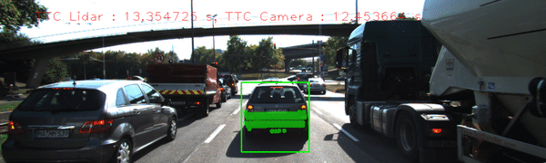

# SFND 3D Object Tracking

Tracking front car to detect accident time

### Tracking
* Used classical vision algorithms detecting Keypoints & descriptors 
* Performed Matching KNN algorithm to match keypoints from frame at time(t) and time(t-1)

### Time to Collision
* TTC is function of the percentage of the avarage matches distance between 2 frames
* Calculated the TTC of the Camera and also by the LIDAR way



## Yolo Weights 
- you should download yolov3 weights to run the code
```
cd dat/yolo
wget https://pjreddie.com/media/files/yolov3.weights
```

### Final Algorithm


## Dependencies for Running Locally
* cmake >= 2.8
  * All OSes: [click here for installation instructions](https://cmake.org/install/)
* make >= 4.1 (Linux, Mac), 3.81 (Windows)
  * Linux: make is installed by default on most Linux distros
  * Mac: [install Xcode command line tools to get make](https://developer.apple.com/xcode/features/)
  * Windows: [Click here for installation instructions](http://gnuwin32.sourceforge.net/packages/make.htm)
* Git LFS
  * Weight files are handled using [LFS](https://git-lfs.github.com/)
* OpenCV >= 4.1
  * This must be compiled from source using the `-D OPENCV_ENABLE_NONFREE=ON` cmake flag for testing the SIFT and SURF detectors.
  * The OpenCV 4.1.0 source code can be found [here](https://github.com/opencv/opencv/tree/4.1.0)
* gcc/g++ >= 5.4
  * Linux: gcc / g++ is installed by default on most Linux distros
  * Mac: same deal as make - [install Xcode command line tools](https://developer.apple.com/xcode/features/)
  * Windows: recommend using [MinGW](http://www.mingw.org/)

## Basic Build Instructions

1. Clone this repo.
2. Make a build directory in the top level project directory: `mkdir build && cd build`
3. Compile: `cmake .. && make`
4. Run it: `./3D_object_tracking`.


